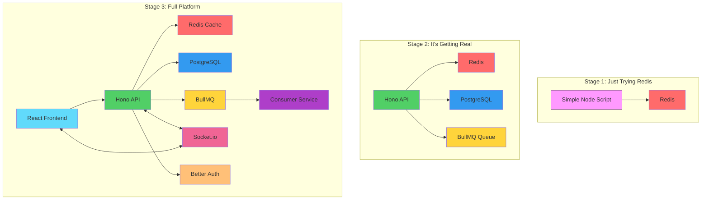

# Architecture Evolution Diagram

## Tech Stack Evolution

### Week 1: "Just Redis"
- Started with a simple experiment
- Basic key-value operations
- No database, no API

### Week 4: "Wait, I Need More"
- Added PostgreSQL for persistent data
- Hono for API framework
- BullMQ for background jobs
- Drizzle ORM for type-safe queries

### Week 8: "This is a Real Product"
- Full React frontend with TanStack Router
- Real-time updates with Socket.io
- Authentication system
- API key management
- Leaderboard system
- Background job processing
- Redis caching layer
